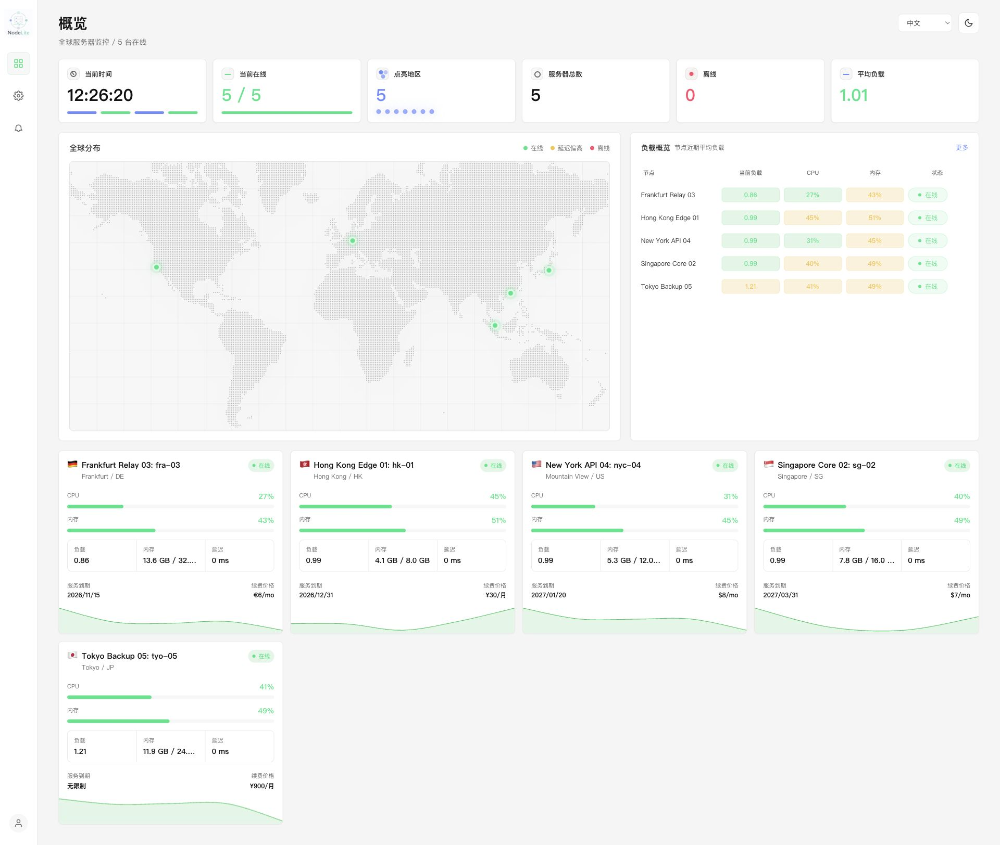
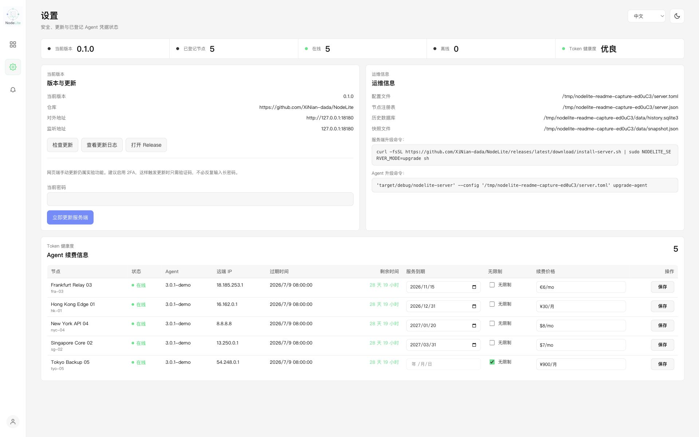
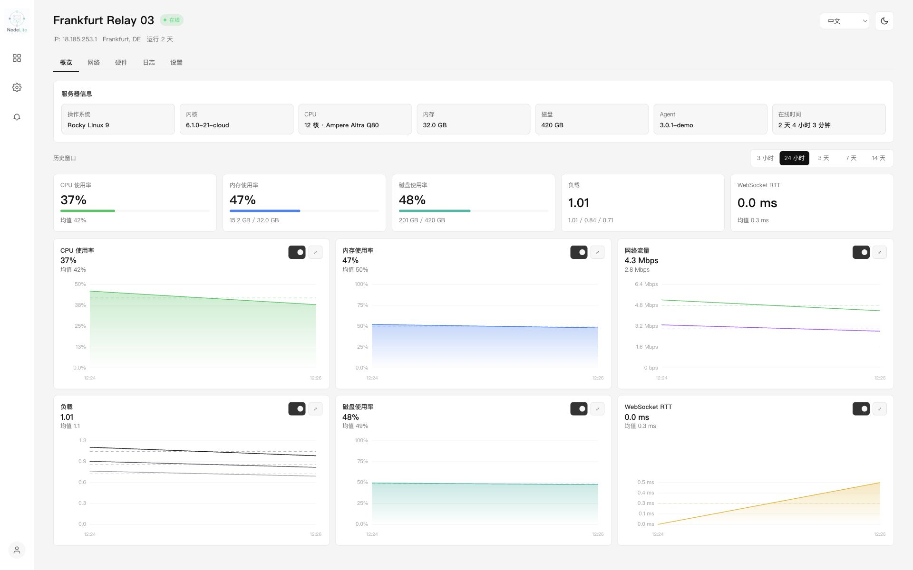
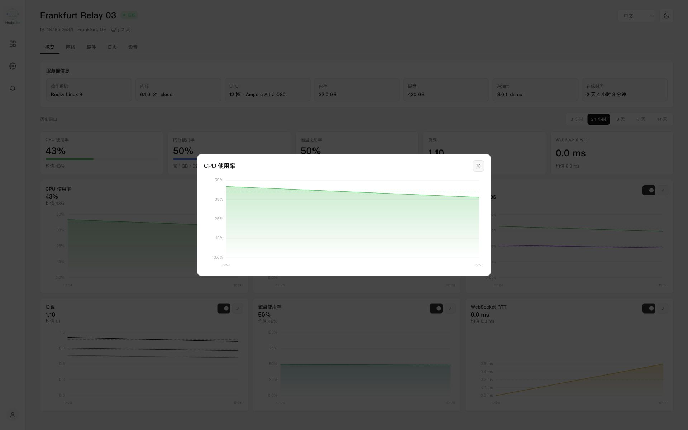
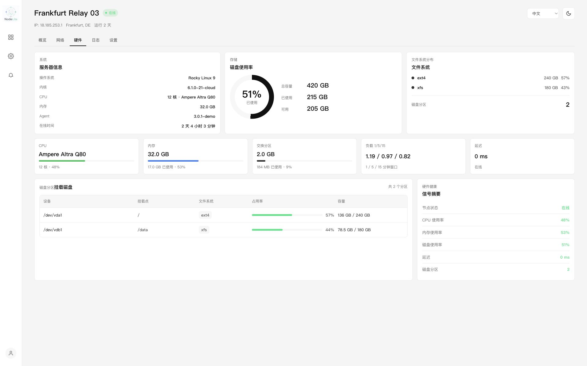
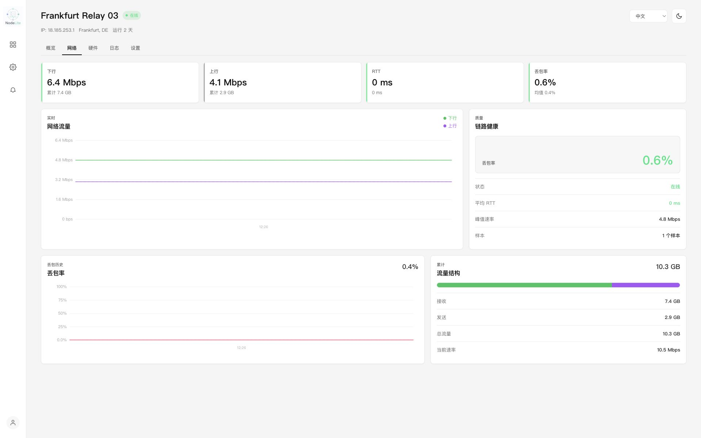
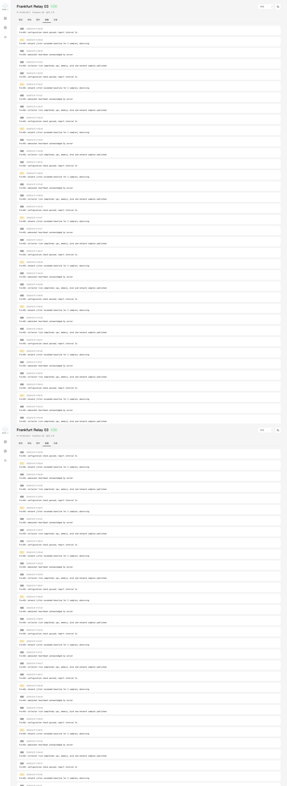
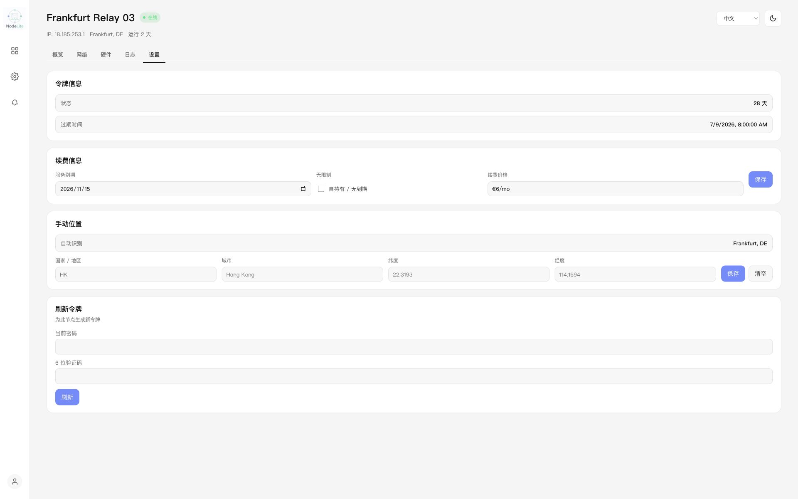

[**中文**](README.md) | [**English**](README.en.md)

[](https://github.com/XiNian-dada/NodeLite/actions/workflows/ci.yml)
[](https://github.com/XiNian-dada/NodeLite/actions/workflows/coverage.yml)

# NodeLite

NodeLite 是一个用 Rust 编写的轻量级服务器监控面板，包含：

- `nodelite-server`
  中心服务，提供 WebSocket 接入、只读页面、只读 JSON API、SQLite 短期历史和快照恢复。
- `nodelite-agent`
  Linux / macOS agent，采集 CPU、负载、内存、磁盘、网络总流量、实时速率和 WebSocket RTT。
- `nodelite-proto`
  服务端与 agent 共用的配置、协议和数据模型。

适合这样的场景：

- 想要一个像哪吒面板那样“服务端 + 一条命令安装 Agent”的监控系统
- 想把面板本体做得尽量轻，优先稳定、低占用、易部署
- 希望网页端以查看为主，敏感配置仍然落在服务端文件与受控入口

## 快速开始

完整的公开部署文档可直接查看 GitHub Pages：
[https://xinian-dada.github.io/NodeLite/](https://xinian-dada.github.io/NodeLite/)

> **版本建议**：请始终使用 [GitHub Releases](https://github.com/XiNian-dada/NodeLite/releases) 中的**最新正式版本**（不含 `-alpha`、`-beta`、`-rc` 标记）。`latest` 指向的即是最新正式版，pre-release 不会被自动选中。不要在正式环境中使用测试版本。

推荐按下面 3 步体验完整流程：

1. 安装服务端

```bash
curl -fsSL https://github.com/XiNian-dada/NodeLite/releases/latest/download/install-server.sh | sudo sh
```

2. 在服务端签发一条子机安装命令

```bash
/usr/local/bin/nodelite-server \
  --config /opt/nodelite/config/server.toml \
  install-agent \
  --node-id hk-01 \
  --node-label "Hong Kong 01"
```

3. 把上一步打印出的命令粘贴到目标 Linux 子机执行

安装成功后：

- 面板通过 `https://你的域名/` 访问
- Agent 通过 `wss://你的域名/ws` 自动接入
- 历史数据默认保留 14 天

## 支持平台

- `nodelite-server`
  推荐部署在 Linux（systemd 环境），官方发布产物提供 `x86_64-unknown-linux-musl` 与 `aarch64-unknown-linux-musl`
- `nodelite-agent`
  支持 Linux 与 macOS；官方发布二进制覆盖 Linux 与 macOS（Intel / Apple Silicon），其中 macOS 的一键安装 / launchd 集成仍属实验性支持，推荐先在测试机验证后再用于长期运行
- 反向代理
  推荐使用 Nginx 或 Caddy 终结 HTTPS / WSS

## 截图展示

### 首页


### 系统设置


### 节点详情


### 实时监控


### 硬件信息


### 网络监控


### Agent 日志


### Agent 设置


## 性能表现

### 运行时占用观察

在 4 个被控端的实际运行环境下，`v2.1.2` 的长期观测值大致如下：

- **服务端内存占用**：4-10 MB
- **Agent 冷启动内存占用**：约 800 KB
- **Agent 运行 24 小时后**：约 1.2 MB
- **Agent 运行 72 小时后**：约 3 MB

这些数字是观测值，不是固定上限。当前版本的 Agent 常驻内存会随着运行时长增加而缓慢上升，因此 `800-1000 KB` 更适合被理解为冷启动基线，而不是长时间运行后的稳定占用。

如果你对 Agent 的长期常驻内存敏感，建议在自己的环境中持续观察 RSS 变化并预留余量。

### v2.2.6 Release 压测基线

下面这组数据来自 `v2.2.6` 在同一台机器上对当前版本连续执行 `3` 次仓库内置 loopback 压测后得到的均值，使用 release 构建直接实测：

```bash
cargo test -p nodelite-server --release load_test_scaling_scores -- --ignored --nocapture
cargo test -p nodelite-server --release load_test_api_surface_scores -- --ignored --nocapture
cargo test -p nodelite-server --release load_test_reconnect_storm_scores -- --ignored --nocapture
```

测试机：`Apple M1 Pro / 32 GB / macOS 26.5`

这组基线走的是真实 WebSocket 建链、真实 `metrics` 上报和真实只读 API 轮询，但仍然是单机 loopback，不包含反向代理、TLS 终结和跨机网络抖动。

相较 README 中上一版 `v2.2.5` 基线，本版本当前样本可见的改进包括：

- `1000` 节点 dashboard fanout 场景下，`/api/nodes` 响应体从 `968995 B` 降到 `285001 B`，约缩小 `70.6%`。
- `1000` 节点 dashboard fanout 场景下，`/api/nodes` p95 从 `12.61 ms` 降到 `3.51 ms`，约下降 `72.2%`。
- `1000` 节点 dashboard fanout 场景下，`/metrics` p95 从 `20.22 ms` 降到 `7.29 ms`，约下降 `64.0%`。
- `1000` 节点 history pressure 场景下，`history` p95 从 `70.90 ms` 降到 `33.86 ms`，约下降 `52.2%`。
- `500` 节点 `64` disk entry 场景下，`/metrics` 响应体从 `3146308 B` 降到 `637182 B`，约缩小 `79.7%`。

#### 吞吐与总览延迟

| 节点数 | 全部接入耗时 | 收敛耗时 | 总 metrics 数 | metrics 吞吐 | overview p50 | overview p95 | overview max |
| --- | ---: | ---: | ---: | ---: | ---: | ---: | ---: |
| 20 | 186.5 ms | 22.3 ms | 240 | 10761.2/s | 0.45 ms | 0.62 ms | 0.83 ms |
| 50 | 456.6 ms | 21.7 ms | 600 | 27671.0/s | 0.46 ms | 0.87 ms | 2.72 ms |
| 100 | 1131.8 ms | 22.5 ms | 1200 | 53484.1/s | 0.58 ms | 1.42 ms | 5.01 ms |
| 200 | 2269.4 ms | 36.5 ms | 2400 | 72864.0/s | 0.54 ms | 5.30 ms | 12.55 ms |

#### 200 节点读接口延迟

`load_test_api_surface_scores` 在 steady-state 下持续上报 `3600` 条 metrics，同时对只读 API 做 20 轮采样；其中历史接口返回的是一个节点 `360` 个种子历史点对应的精确时间区间。下表同样使用 `3` 次重复执行后的均值。

| 接口 | p50 | p95 | max |
| --- | ---: | ---: | ---: |
| `/api/overview` | 0.66 ms | 2.72 ms | 6.54 ms |
| `/api/nodes` | 0.67 ms | 2.93 ms | 3.48 ms |
| `/api/nodes/{node_id}` | 0.66 ms | 2.98 ms | 3.21 ms |
| `/api/nodes/{node_id}/history` | 1.59 ms | 3.54 ms | 4.99 ms |

#### 200 节点重连风暴

`load_test_reconnect_storm_scores` 会把 `200` 个节点连续拉起和断开 `4` 轮，共计 `800` 次会话建立。下面这些数值也使用 `3` 次重复执行后的均值：

- **批量接入 p95**：1822.13 ms
- **最后一轮指标恢复 p95**：74.66 ms
- **批量断开完成 p95**：22.84 ms
- **风暴期间 `/api/overview` p95**：2.56 ms
- **风暴期间 `/api/nodes` p95**：3.12 ms

说明：

- 这里的“接入耗时”指批量节点建立 WebSocket 并完成认证的时间。
- “收敛耗时”指最后一轮指标上报完成、服务端状态更新到位的时间。
- 这组成绩主要用于展示当前版本的大致量级感，不等同于生产 SLA。
- 实际表现会受到构建模式、反向代理、SQLite I/O、历史保留时长、TLS 和宿主机网络条件影响。

#### 大规模回归压测

下面这组压测默认标记为 `ignored`，只在手动排查性能回归时运行，不影响默认 CI：

```bash
cargo test -p nodelite-server --release load_test_large_fleet_scores -- --ignored --nocapture
cargo test -p nodelite-server --release load_test_dashboard_fanout_scores -- --ignored --nocapture
cargo test -p nodelite-server --release load_test_history_pressure_scores -- --ignored --nocapture
cargo test -p nodelite-server --release load_test_payload_size_scores -- --ignored --nocapture
```

覆盖范围：

- `load_test_large_fleet_scores`：`500` / `1000` 节点 loopback WebSocket 上报，同时采样 `/api/overview`、`/api/nodes` 和 Prometheus `/metrics`。
- `load_test_dashboard_fanout_scores`：`1000` 节点、`20` 个 dashboard reader 并发刷新，并穿插 Prometheus scrape。
- `load_test_history_pressure_scores`：`1000` 节点下对历史查询做并发 reader 压力，覆盖 SQLite 读写竞争。
- `load_test_payload_size_scores`：`500` 节点、每节点 `64` 个 disk entry，观察大 payload 的 API body 和渲染前置压力。

每条 `*_RESULT` 输出都会包含对应场景的 p95 延迟、API body bytes 的 `p50/p95/max`、当前进程 RSS、history writer queue depth、dropped writes，以及 SQLite `db/wal/shm` 文件大小。

下面这张表仍然是本次同机实测的单次样本结果，用来展示更大规模场景的大致量级，不作为多轮均值基线：

| 场景 | 关键规模 | metrics 吞吐 | 关键 p95 | 响应体大小 | RSS | history dropped writes |
| --- | --- | ---: | --- | --- | ---: | ---: |
| `load_test_large_fleet_scores` | `500` 节点 | `68678.5/s` | `overview 1.18 ms` / `nodes 1.67 ms` / `metrics 7.55 ms` | `overview 257 B` / `nodes 142501 B` / `metrics 637186 B` | `194.8 MiB` | `0` |
| `load_test_large_fleet_scores` | `1000` 节点 | `89675.3/s` | `overview 1.56 ms` / `nodes 4.08 ms` / `metrics 18.54 ms` | `overview 261 B` / `nodes 285001 B` / `metrics 1264700 B` | `335.7 MiB` | `0` |
| `load_test_dashboard_fanout_scores` | `1000` 节点 + `20` readers | `88934.8/s` | `overview 2.08 ms` / `nodes 3.51 ms` / `metrics 7.29 ms` | `overview 261 B` / `nodes 285001 B` / `metrics 1264700 B` | `337.9 MiB` | `0` |
| `load_test_history_pressure_scores` | `1000` 节点 + `20` history readers | `90773.1/s` | `history 33.86 ms` | `history 50823 B` | `334.6 MiB` | `0` |
| `load_test_payload_size_scores` | `500` 节点 + `64` disk entries | `43559.1/s` | `nodes 1.55 ms` / `metrics 14.81 ms` | `nodes 142501 B` / `metrics 637182 B` | `222.8 MiB` | `0` |

首页 DOM 渲染压力可以用真实 `nodelite-server/assets/index.html` 生成自包含 fixture：

```bash
node scripts/benchmark-index-dom.mjs --nodes 500
node scripts/benchmark-index-dom.mjs --nodes 1000
```

脚本会写入 `target/load-test/index-dom-*.html`。用浏览器打开生成文件后，页面右下角会显示 `renderMs`、`jsHeapBytes`、`domNodeCount` 和 `nodeCardCount`，同一份结果也会挂到 `window.__NODELITE_DOM_BENCHMARK__` 便于控制台读取。需要模拟大磁盘 payload 时可追加 `--disks 64`。

## 当前能力

- 一键安装与升级：
  - `install-server.sh`
  - `install-agent.sh`
  - `nodelite-server install-agent`
  - `nodelite-server upgrade-agent`
- 服务端只读页面：
  - `/`
  - `/nodes/{node_id}`
- 服务端只读 API：
  - `/api/overview`
  - `/api/nodes`
  - `/api/nodes/{node_id}`
  - `/api/nodes/{node_id}/history`
- agent 接入协议：
  - `hello`
  - `metrics`
  - `ping`
  - `pong`
  - `server_notice`
  - `refresh_token_request`
  - `refresh_token_response`
- 设置页：
  - 查看服务端版本、路径、历史保留与节点 token 到期时间
  - 修改只读面板密码
  - 启用 / 禁用 TOTP 2FA
  - 手动触发服务端更新并查看更新日志
- 14 天 SQLite 历史保留
- 快照落盘与进程重启后恢复最近状态
- agent 指数退避自动重连

## 历史数据语义

历史图用于展示基础趋势,不是逐条 `metrics` 上报的完整归档。Server 默认同一节点每 30 秒最多写入一个历史点,并在查询时按时间窗口和 `max_points` 返回适合绘图的采样结果。

历史写入走 bounded queue + batch SQLite writer。队列满时 Server 会优先保证实时 WebSocket 心跳和面板当前状态,丢弃该次历史写入并递增 `/metrics` 中的 `nodelite_history_dropped_writes_total`。这个值长期应为 0;如果持续增长,说明历史 writer 跟不上上报速率或磁盘 I/O,历史图可能出现缺口,但实时视图仍会继续更新。

## 本地构建

```bash
cargo check
```

## Prometheus 抓取

NodeLite 现在提供受保护的 `/metrics` 端点，输出 Prometheus exposition text。它和仪表盘共用只读认证，因此抓取端需要带上同一组 Basic Auth 凭据。

先用 `curl` 验证：

```bash
curl -u viewer:secret https://monitor.example.com/metrics
```

Prometheus 示例：

```yaml
scrape_configs:
  - job_name: nodelite
    scheme: https
    metrics_path: /metrics
    basic_auth:
      username: viewer
      password: secret
    static_configs:
      - targets:
          - monitor.example.com
```

常用运维指标:

- `nodelite_history_dropped_writes_total`: 历史写入队列满时丢弃的历史点总数。
- `nodelite_history_queue_depth` / `nodelite_history_queue_capacity`: 历史 writer 当前排队量与队列容量。
- `nodelite_audit_dropped_writes_total`: 审计写入队列满时丢弃的审计事件总数。
- `nodelite_audit_queue_depth` / `nodelite_audit_queue_capacity`: 审计 writer 当前排队量与队列容量。
- `nodelite_audit_write_failures_total`: 审计 writer 入队或落库失败总数。
- `nodelite_view_cache_hits_total{kind}` / `nodelite_view_cache_misses_total{kind}`: `overview`、`nodes`、`metrics` 视图响应体缓存命中与未命中次数。
- `nodelite_api_body_bytes{kind}` / `nodelite_metrics_response_body_bytes`: 最近一次构建的 API、基础 `/metrics` 与最终 `/metrics` 响应体大小。
- `nodelite_process_resident_memory_bytes`: Server 进程 RSS,用于定位常驻内存增长。
- `nodelite_sqlite_file_bytes{kind}`: history/audit SQLite 主文件、WAL 与 SHM 文件大小。
- `nodelite_sqlite_wal_checkpoint_observed{database}`: 最近一次 passive WAL checkpoint probe 是否成功。
- `nodelite_sqlite_wal_checkpoint_active{database}`: SQLite 库当前是否处于 WAL journal mode。
- `nodelite_sqlite_wal_checkpoint_busy{database}`: `PRAGMA wal_checkpoint(PASSIVE)` 返回的 busy 标志。
- `nodelite_sqlite_wal_checkpoint_pages{database,state}`: `log`、`checkpointed` 与 `backlog` WAL 页数。`backlog` 持续增长且 WAL 文件 bytes 同步增长时,通常说明 checkpoint 被长读事务或磁盘 I/O 拖住。
- `nodelite_registry_nodes`: 当前加载的注册节点数量。
- `nodelite_registry_disk_entries_total`: 当前节点快照中持有的磁盘条目总数。
- `nodelite_ws_messages_total{type}`: 已认证 WebSocket 消息按类型累计计数。

SQLite 运维提示:

- History 使用 WAL 模式提升写入/查询并发,`/metrics` 会最多每 60 秒执行一次受控的 `wal_checkpoint(PASSIVE)` probe。`PASSIVE` 不会截断 WAL,也不会等待其它连接释放锁;它会尝试推进可 checkpoint 的 WAL 页,并返回当前 WAL 页数、已 checkpoint 页数和 busy 状态。
- History 和 Audit 的 retention prune 使用 `DELETE` 删除过期行。SQLite 主库文件不会因为 `DELETE` 立即缩小,WAL 也可能在 checkpoint 前保持较大;这属于 SQLite 的正常文件复用行为。
- `nodelite_sqlite_file_bytes{kind="history_wal"}` 或 `kind="audit_wal"` 持续增长时,建议同时告警 `nodelite_sqlite_wal_checkpoint_pages{state="backlog"}` 和 busy 标志,用来区分写入增长、checkpoint 被阻塞和外部磁盘问题。
- 如需回收主库文件空洞,在维护窗口停止服务或确保无长事务后手动执行 `VACUUM`;如需强制截断 WAL,应在维护窗口对目标库执行 `PRAGMA wal_checkpoint(TRUNCATE)`。不要在高峰期把这些操作放进自动热路径。

## 测试覆盖率

安装 [cargo-tarpaulin](https://github.com/xd009642/tarpaulin)(仅需一次,仅支持 Linux):

```bash
cargo install cargo-tarpaulin
```

运行覆盖率分析:

```bash
cargo tarpaulin --config tarpaulin.toml
```

HTML 报告输出到 `target/tarpaulin/tarpaulin-report.html`,可用浏览器打开查看逐行覆盖情况。

### 覆盖率目标

| 阶段 | 目标 | 时间 |
| --- | --- | --- |
| 基线 | 记录当前值 | 立即 |
| 短期 | 75% | 2 周内 |
| 长期 | 80% | 持续 |

重点覆盖模块:auth、admission、sanitize、registry(安全关键路径)。

如需单独跑新增的属性测试，可直接使用：

```bash
cargo test -p nodelite-server sanitize::tests
cargo test -p nodelite-server registry::tests
```

## 交叉编译 Linux x86_64 / aarch64

仓库内已经包含 musl 目标的 `lld` 链接配置，可以直接构建静态 Linux 二进制：

```bash
cargo build --release --target x86_64-unknown-linux-musl \
  -p nodelite-server \
  -p nodelite-agent

cargo build --release --target aarch64-unknown-linux-musl \
  -p nodelite-server \
  -p nodelite-agent
```

产物位置：

```bash
target/x86_64-unknown-linux-musl/release/nodelite-server
target/x86_64-unknown-linux-musl/release/nodelite-agent
target/aarch64-unknown-linux-musl/release/nodelite-server
target/aarch64-unknown-linux-musl/release/nodelite-agent
```

## 推荐部署拓扑

生产环境建议这样放：

1. `nodelite-server` 监听在 `127.0.0.1:8080`
2. Nginx 或 Caddy 对外暴露 `443`
3. 面板和 API 走 HTTPS
4. Agent 通过 `wss://你的域名/ws` 接入

这样可以把 TLS、访问日志、限流和基础访问控制都放到反代层。

## 服务端部署

推荐直接用 GitHub Release 里的交互式安装器。它会清屏、询问安装目录、监听端口、对外域名或 IP、只读面板账号密码，然后自动：

- 按当前架构下载最新的 `nodelite-server`
- 拉取 `SHA256SUMS.txt` 并校验二进制
- 生成 `server.toml` 和 `server.json`
- 注册并启动 `nodelite-server.service`

一条命令安装：

```bash
curl -fsSL https://github.com/XiNian-dada/NodeLite/releases/latest/download/install-server.sh | sudo sh
```

同一条命令以后也可以直接拿来升级。脚本会自动识别现有安装，并默认切到 `upgrade` 模式；如果你想强制指定，也可以：

```bash
curl -fsSL https://github.com/XiNian-dada/NodeLite/releases/latest/download/install-server.sh | \
  sudo NODELITE_SERVER_MODE=upgrade sh
```

脚本默认会：

- 把程序数据放到你输入的安装目录下，默认建议 `/opt/nodelite`
- 监听在 `127.0.0.1:<随机端口>`
- 要求你输入对外访问的域名或 IP，并据此生成 `public_base_url`
- 生成一组只读面板 Basic Auth 账号
- 生成带 `NoNewPrivileges`、`ProtectSystem`、`ProtectKernel*`、`CapabilityBoundingSet=` 等限制的 systemd service
- 如果是升级，只替换二进制与 systemd unit，保留现有 `server.toml`、面板账号密码、节点 token 和注册表内容不变

安装完成后会直接打印：

- 服务端二进制路径
- 配置文件路径
- 节点注册表路径
- 面板只读用户名和密码
- 下一条该执行的 `install-agent` 签发命令

如果你更想手工部署，也可以：

1. 复制 [config/server.example.toml](config/server.example.toml) 和 [config/server.json.example](config/server.json.example)
2. 把服务端二进制安装到 `/usr/local/bin/nodelite-server`
3. 手工创建 systemd unit
4. 启动 `nodelite-server.service`

最少要确认的配置项是：

```toml
[server]
listen = "127.0.0.1:28080"
public_base_url = "https://monitor.example.com"
trusted_proxies = ["203.0.113.0/24"]
node_registry_path = "/opt/nodelite/config/server.json"
history_db_path = "/opt/nodelite/data/history.sqlite3"
snapshot_path = "/opt/nodelite/data/snapshot.json"

[auth]
username = "viewer"
password = "change-this-password"
# 默认关闭;开启后必须配置 totp_secret。
enable_2fa = false
# totp_secret = "JBSWY3DPEHPK3PXP"

[audit]
enabled = true
db_path = "/opt/nodelite/data/audit.sqlite3"
retention_days = 90
log_successful_auth = true
log_failed_auth = true
log_token_events = true
log_rate_limit = true

[alerts]
enabled = false

[alerts.smtp]
enabled = false
host = ""
port = 587
username = ""
sender = ""
recipients = []
transport = "start_tls"
send_resolved = true

[alerts.webhook]
enabled = false
url = ""
send_resolved = true

[alerts.inspection]
enabled = false
local_time = "09:00"
lookback_hours = 24
delivery = ["smtp"]
offline_grace_minutes = 10
latency_warn_ms = 250
cpu_warn_percent = 85
memory_warn_percent = 90

[ws]
max_total_connections = 1024
max_connections_per_ip = 32
auth_fail_window_secs = 300
auth_fail_max_attempts = 12
auth_block_secs = 900
```

查看服务端状态：

```bash
sudo systemctl status nodelite-server.service
sudo journalctl -u nodelite-server.service -f
```

如果服务端起不来，第一时间检查：

```bash
sudo journalctl -u nodelite-server.service -n 100 --no-pager
```

## 认证与安全

NodeLite 的默认安全模型是：面板默认以只读查看为主，Agent 使用逐节点 token 接入，敏感配置优先通过服务端文件、CLI 与受保护的设置页修改。

### Web 面板认证

- `/`、`/nodes/*`、`/api/*` 受只读 Basic Auth 保护。
- 如果 `server.listen` 不是回环地址，配置文件必须提供 `[auth] username/password`，否则服务端会拒绝启动。
- `READONLY_PASSWORD` 或配置文件里的 `auth.password` 至少需要 8 个字符；如果没有同时包含字母和数字，服务端会在启动日志中给出弱密码警告。
- 设置页中的敏感操作（修改密码、启停 2FA、手动更新）会再次要求当前密码或 2FA 验证，不依赖单纯的前端按钮显示。
- 前端会记录本浏览器的登录时间，超过 24 小时后跳转到 `/logout-and-reauth`，触发浏览器重新认证。这是浏览器侧的便利逻辑（JS + localStorage），并不是安全边界——攻击者禁用 JS 或篡改 localStorage 都可以绕过它。真正的过期由服务端 Cookie 的 `Max-Age` 与服务端 session store 共同强制：到点后 cookie 被浏览器丢弃，store 内的票据也会被 prune，受保护接口照常返回 401。

### 可选 TOTP 2FA

TOTP 默认关闭。要开启二次验证，在 `server.toml` 里写：

```toml
[auth]
username = "viewer"
password = "a-strong-password-123"
enable_2fa = true
totp_secret = "JBSWY3DPEHPK3PXP"
```

生成一个新的 base32 secret：

```bash
python3 - <<'PY'
import base64, secrets
print(base64.b32encode(secrets.token_bytes(20)).decode().rstrip("="))
PY
```

把 secret 加进认证器 App 时，可以手工录入，也可以按下面格式生成二维码：

```text
otpauth://totp/NodeLite:viewer?secret=<totp_secret>&issuer=NodeLite
```

2FA 行为说明：

- 登录流程是 `Basic Auth -> /verify-2fa 输入 6 位 TOTP -> 进入面板`。
- TOTP 校验允许前后各一个 30 秒窗口的时钟偏差，并以常量时间比较 code，同一个 30 秒步长在 90 秒内不允许被两次使用（RFC 6238 §5.2 重放防御）。
- Basic Auth 通过后的 TOTP 等待窗口是 5 分钟。同一个 pending session 连续 5 次输错 TOTP 即被强制失效，攻击者必须重新走 Basic Auth 才能再次尝试；客户端 IP 还会被 `[ws] auth_fail_*` 阈值限流。
- 2FA 通过后的会话有效期是 24 小时，cookie 为 `HttpOnly`、`SameSite=Strict`；`public_base_url` 必须是 `https://`，cookie 会带 `Secure`——否则启动时会拒绝配置，避免 TOTP 与 cookie 在明文链路上传输。
- 2FA 默认关闭，旧配置不需要修改即可继续运行。

### Agent Token 生命周期

- 每个节点都有独立 token，存放在服务端 `server.json` 中。
- 新签发或轮换的 node token 默认 30 天有效。
- 服务端在 WebSocket `hello` 阶段检查 token 是否过期，过期时会先下发一条 `token expired; run install-agent --rotate-token...` 的 Error notice 再关闭连接，方便运维从 Agent 日志直接看到补救步骤。
- 已认证的长连接会在 token 距离过期不足 7 天时自动刷新；服务端先把刷新帧发出去，确认 send 成功后才把会话内的 token 视为新值，避免"server 内存里是新 token 但 agent 没收到"的不一致状态。Agent 收到后用 fsync + 0o600 原子写回 `agent.toml`，crash 不会留下空文件。
- 旧版 `server.json` 中没有过期时间的 token 会在节点下一次在线会话里被自动刷新成 30 天 token。
- 如果某台 Agent 离线超过 token 有效期，它无法再用旧 token 自动刷新；Agent 进入 1 小时间隔的退避，等运维在服务端执行 `install-agent --rotate-token` 并替换该节点的 `agent.toml` 后才能恢复。

### 审计日志

- 服务端会把认证失败、TOTP 校验结果、无效 install token / node token、限流封禁和成功的节点握手写入独立的 `audit.sqlite3`。
- `[audit]` 段可以控制审计是否启用、保留天数以及不同类型事件是否记录；默认保留 90 天。
- `/api/audit-log` 走和其它 `/api/*` 一样的只读认证保护，支持 `start`、`end`、`event_type`、`success`、`limit` 这些查询参数。

例如只看最近 100 条失败认证：

```text
/api/audit-log?event_type=login_failure&success=false&limit=100
```

## 告警与巡检

- 服务端配置支持 `[alerts]` 段，用于声明 SMTP、WebHook、规则式告警和每日巡检摘要。
- `[[alerts.rules]]` 可以按 `cpu_usage_percent`、`memory_usage_percent`、`disk_usage_percent`、`latency_ms`、`offline_minutes` 这些指标定义阈值规则，并按全部节点、指定节点 ID 或指定标签范围生效。
- `[alerts.inspection]` 用于配置每日巡检摘要的发送时间、回看窗口和巡检阈值，方便定时给用户发送“最近服务器状态如何”的概览。
- 当前版本已经把这些配置纳入 `server.toml` 与 Web 设置页的数据模型，便于先统一管理；如需真正的外发通道，请同时完成 SMTP / WebHook 目标端的联通性验证。

## Nginx 反代示例

如果你用 Nginx，可以参考：

```nginx
server {
    listen 80;
    server_name monitor.example.com;
    return 301 https://$host$request_uri;
}

server {
    listen 443 ssl http2;
    server_name monitor.example.com;

    ssl_certificate     /path/to/fullchain.pem;
    ssl_certificate_key /path/to/privkey.pem;

    location / {
        proxy_pass http://127.0.0.1:8080;
        proxy_http_version 1.1;
        proxy_set_header Host $host;
        proxy_set_header X-Forwarded-For $proxy_add_x_forwarded_for;
        proxy_set_header X-Real-IP $remote_addr;
        proxy_set_header X-Forwarded-Proto $scheme;
    }

    location /ws {
        proxy_pass http://127.0.0.1:8080/ws;
        proxy_http_version 1.1;
        proxy_set_header Upgrade $http_upgrade;
        proxy_set_header Connection "upgrade";
        proxy_set_header Host $host;
        proxy_set_header X-Forwarded-For $proxy_add_x_forwarded_for;
        proxy_set_header X-Real-IP $remote_addr;
        proxy_set_header X-Forwarded-Proto $scheme;
        proxy_read_timeout 120s;
        proxy_send_timeout 120s;
    }

    location /install/ {
        proxy_pass http://127.0.0.1:8080;
        proxy_http_version 1.1;
        proxy_set_header Host $host;
        proxy_set_header X-Forwarded-For $proxy_add_x_forwarded_for;
        proxy_set_header X-Real-IP $remote_addr;
        proxy_set_header X-Forwarded-Proto $scheme;
    }
}
```

## 节点签发

推荐直接在服务端执行 `install-agent` 子命令。它不会启动监听，只会修改 `server.json`、生成一次性 install token，然后打印一条可直接粘贴到子机上的安装命令。

```bash
/usr/local/bin/nodelite-server \
  --config /opt/nodelite/config/server.toml \
  install-agent \
  --node-id hk-01 \
  --node-label "Hong Kong 01" \
  --tag apac \
  --tag edge
```

这个命令会：

- 在 `server.json` 里创建或复用 `hk-01`
- 为该节点生成独立 token
- 生成一个 15 分钟有效的一次性 install token
- 直接打印一条完整的子机安装命令
- 让运行中的服务端在下一次注册表轮询时自动接纳新 token，无需重启进程

注意：

- `/`、`/nodes/*`、`/api/*` 默认受 HTTP Basic Auth 保护
- 安装脚本本身是公开静态文件；真正的节点配置通过一次性 install token 从 `/install/bootstrap` 拉取
- `install-agent` 只会把一次性 install token 内联到命令里，长期 node token 仍然只通过 bootstrap 响应体下发

如果你想看更详细的输出，包括 `agent.toml` 片段和到期时间，也可以继续使用 `issue-node`：

```bash
/usr/local/bin/nodelite-server \
  --config /opt/nodelite/config/server.toml \
  issue-node \
  --node-id hk-01 \
  --node-label "Hong Kong 01"
```

如果你需要轮换某个节点 token，可以追加 `--rotate-token`。

如果你只想给已经安装过的 agent 打印一条升级命令，不需要节点参数，可以直接在服务端执行：

```bash
/usr/local/bin/nodelite-server \
  --config /opt/nodelite/config/server.toml \
  upgrade-agent
```

## 一键安装

服务端 `install-agent` 打印出来的命令大概长这样：

```bash
curl -fsSL https://monitor.example.com/install/install-agent.sh | \
  NODELITE_AGENT_INSTALL_TOKEN='one-time-token' sh -s -- \
  --bootstrap-url https://monitor.example.com/install/bootstrap \
  --base-url https://github.com/XiNian-dada/NodeLite/releases/latest/download
```

说明：

- 脚本会检测架构并下载对应的 `nodelite-agent-<target>` 二进制
- 脚本会先把 GitHub `latest` 解析成具体 tag，再下载同一个 release 下的 `SHA256SUMS.txt` 和 agent 二进制，避免刚发版时 CDN 短时间不一致
- 一次性 install token 已经内联在命令里，所以正常情况下不需要再手工输入
- 长期 node token 只通过 bootstrap 响应体下发，不出现在 URL 或命令参数里
- Linux:
  会创建 `nodelite-agent` 专用系统用户，并以该用户运行 systemd service；写入 `/etc/nodelite/agent.toml`；生成带最小权限沙箱限制的 `nodelite-agent.service`；执行 `daemon-reload`、`enable` 和 `restart`
- macOS（实验性）:
  当前使用 root + launchd 的最小实现，不会额外创建专用服务用户；会生成 `/Library/LaunchDaemons/com.nodelite.agent.plist` 并通过 `launchctl bootstrap/kickstart` 启动；日志默认落到 `/var/log/nodelite-agent.log` 与 `/var/log/nodelite-agent.err.log`

### 子机安装步骤

推荐按下面顺序操作：

1. 在服务端执行 `install-agent`
2. 复制它打印出的安装命令到目标子机（Linux 正式支持，macOS 为实验性支持）
3. 子机直接执行
4. 等脚本结束后检查服务状态

检查 Agent 服务：

```bash
# Linux
sudo systemctl status nodelite-agent.service
sudo journalctl -u nodelite-agent.service -f

# macOS (experimental)
sudo launchctl print system/com.nodelite.agent
sudo tail -f /var/log/nodelite-agent.log /var/log/nodelite-agent.err.log
```

如果你想手工运行安装脚本，也可以：

```bash
sh scripts/install-agent.sh \
  --bootstrap-url https://monitor.example.com/install/bootstrap \
  --install-token <one-time-token> \
  --base-url https://github.com/XiNian-dada/NodeLite/releases/latest/download
```

如果这台子机已经装过了，后续升级可以更简单，不需要重新拿 bootstrap：

```bash
curl -fsSL https://monitor.example.com/install/install-agent.sh | \
  NODELITE_AGENT_MODE=upgrade sh -s -- \
  --base-url https://github.com/XiNian-dada/NodeLite/releases/latest/download
```

升级模式会：

- 只替换 agent 二进制
- Linux 下重写并补齐 systemd service；macOS 下重写并重载 launchd plist
- 保留现有 `/etc/nodelite/agent.toml`
- 自动修正目录和文件权限
- Linux 下清理旧版本曾经写入的 `nodelite-agent-auto-update.*` 定时更新单元

如果你在升级时也传了 `--bootstrap-url` 和 install token，它会顺手刷新 agent 配置。

NodeLite 目前不再安装无人值守自动更新 timer。升级建议由管理员手动触发：先确认 release notes 与协议兼容，再执行 `--mode upgrade` 或在已鉴权的面板设置页点击更新。Agent 与 Server 的 WebSocket 握手包含显式 `protocol_version`，如果未来跨大版本出现不兼容协议，Server 会在握手阶段拒绝不匹配的 Agent 并记录警告，而不是让节点以未知协议继续运行。

如果你已经有精确二进制地址，也可以继续使用自定义下载地址和校验文件：

```bash
sh scripts/install-agent.sh \
  --bootstrap-url https://monitor.example.com/install/bootstrap \
  --install-token <one-time-token> \
  --checksums-url https://your-host/releases/SHA256SUMS.txt \
  --binary-url https://your-host/releases/nodelite-agent-x86_64-unknown-linux-musl
```

如果 `--binary-url` 使用了自定义文件名，建议直接显式传入对应架构的 SHA-256，避免脚本按 release artifact 名称匹配 `SHA256SUMS.txt` 时找不到条目：

```bash
sh scripts/install-agent.sh \
  --bootstrap-url https://monitor.example.com/install/bootstrap \
  --install-token <one-time-token> \
  --binary-url https://your-host/releases/agent-linux-x86_64 \
  --sha256-x86_64 <64-character-sha256>
```

## 手工 Agent 启动

如果你暂时不想用安装脚本，也可以手工部署 agent。macOS 如果不想使用实验性的安装脚本，仍推荐直接下载 GitHub Release 里的 `nodelite-agent-x86_64-apple-darwin` / `nodelite-agent-aarch64-apple-darwin`，再按这一种方式运行。

1. 复制配置：

```bash
cp config/agent.example.toml config/agent.toml
```

2. 把 `node_id`、`node_label`、`server`、`token` 替换成服务端签发输出的内容。

3. 本机采样自检：

```bash
cargo run -p nodelite-agent -- --config config/agent.toml --sample-once
```

这一步现在同时适用于 Linux 和 macOS；首次采样时 CPU 百分比与网络速率会因为没有上一轮基线而显示为 `0` / `null`，属于正常现象。

4. 正常运行：

```bash
cargo run -p nodelite-agent -- --config config/agent.toml
```

## 常见排障

- 面板能打开但没有节点，先看 Agent 日志里是不是 `wss://.../ws` 证书或反代问题。
- 如果服务端日志里频繁出现 TLS 警告，说明你还在用 `http://` 或 `ws://` 明文链路。
- 如果刚关闭 2FA 但服务端因为 `totp_secret` 配置起不来，请升级到 `1.2.16` 或更新版本。
- 如果子机安装时提示 `invalid install token`，通常是一次性 token 过期了，重新执行一次 `install-agent` 或 `issue-node` 即可。
- 如果 Agent 被 `/ws` 限流挡住，先检查服务端 `[ws]` 配额是否太小，或者远端反代/WAF 的出口网段是否已经写进 `server.trusted_proxies`；同机 Nginx/Caddy 不需要额外配置。

## GitHub Release

仓库内置了一个 tag 驱动的发布工作流。当推送新的语义化版本 tag，例如 `1.0.0` 或 `v1.0.0` 时，GitHub Actions 会自动：

1. 交叉编译 Linux `x86_64-unknown-linux-musl`
2. 交叉编译 Linux `aarch64-unknown-linux-musl`
3. 原生构建 Agent `x86_64-apple-darwin`
4. 原生构建 Agent `aarch64-apple-darwin`
5. 生成 `nodelite-server-x86_64-unknown-linux-musl`
6. 生成 `nodelite-agent-x86_64-unknown-linux-musl`
7. 生成 `nodelite-server-aarch64-unknown-linux-musl`
8. 生成 `nodelite-agent-aarch64-unknown-linux-musl`
9. 生成 `nodelite-agent-x86_64-apple-darwin`
10. 生成 `nodelite-agent-aarch64-apple-darwin`
11. 上传 `install-server.sh` 和 `install-agent.sh`
12. 上传 `SHA256SUMS.txt`
13. 自动创建 GitHub Release

GitHub Release 编译出来的 agent 会把对应 tag 版本号上报到面板里，所以面板里看到的 Agent 版本会是 `1.0.x` 这种发布版本，而不是固定的开发版本号。

## 说明

- 面板主体以只读监控为主；设置页提供有限的受保护写操作，例如密码修改、2FA 开关和手动更新。
- `/healthz` 和 `/ws` 不走只读面板鉴权；面板和 JSON API 走 HTTP Basic Auth；安装脚本和 bootstrap 接口使用独立安装流程。
- agent 只接受服务端 `server.json` 中已登记节点的逐节点 token。
- server 内部的公共边界优先暴露 typed error（例如 `RegistryError`、`HistoryError`、`AuthSessionError`、`ProtocolError`）；`anyhow` 主要留在模块内部 helper 用来补上下文。
- 首版 agent 只支持 Linux。
- 当前历史图保存基础趋势，不做长期归档；高压情况下可能因队列满丢弃历史点，详见“历史数据语义”。
- 生产环境建议放在 Nginx 或 Caddy 后面并启用 HTTPS。
